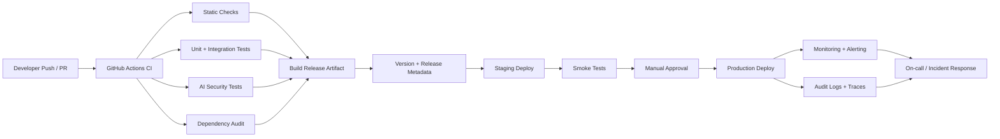

# WriteAgent ML/LLMSecOps Pipeline

This document defines a practical ML/LLMSecOps pipeline for WriteAgent. It covers:

- Automated testing, including AI security tests
- Versioning and tracking
- Deployment strategy
- Monitoring and alerting
- Logging and auditability

## CI/CD Diagram



## 1. Automated Testing

The pipeline should block deployment unless all required checks pass.

### Standard checks

- Python dependency installation
- `pytest` unit tests
- `pytest` integration tests
- FastAPI import and application boot smoke check

### AI security tests

These tests target LLM-specific risks already visible in the codebase.

- Prompt injection resistance
  - Verify `guardrails/input_sanitizer.py` rejects known jailbreak and instruction override patterns
- Output safety filtering
  - Verify `guardrails/content_filter.py` blocks prohibited outputs
- Consistency safety
  - Verify contradiction detection still flags hard conflicts after prompt or model changes
- Auditability guarantees
  - Verify key agent calls still produce audit entries

### Recommended future additions

- Schema-conformance tests for all agent JSON outputs
- Regression tests for prompt versions
- Adversarial red-team suites for injected human events and malformed scene briefs
- Load tests for scene generation latency and state persistence

## 2. Versioning And Tracking

WriteAgent has several things that must be versioned independently.

### Code

- Source code versioned with Git
- Protected main branch with pull requests required
- Semantic releases for deployable versions, for example `v1.2.0`

### Prompt assets

- Prompt files under `prompts/<version>/`
- Every prompt update should create or update a version directory
- Production should pin an explicit prompt version through configuration

### Model and runtime metadata

Track the following in release notes or deployment metadata:

- Model name, such as `qwen-max`
- Base URL/provider
- Prompt version
- Dependency lock snapshot
- Commit SHA

### Generated run metadata

For each scene generation, persist:

- `novel_id`
- `scene_number`
- `agent_id`
- prompt version
- token counts
- latency
- contradiction and negotiation history

This is already partially implemented in `utils/audit_logger.py` and `/api/v1/audit/*`.

## 3. Deployment Strategy

Use a staged promotion model.

### Environments

- `dev`: local developer runs
- `staging`: automatic deployment after CI succeeds on main
- `production`: manual approval after staging smoke tests

### Deployment approach

- Build a versioned artifact or container image per commit on main
- Deploy to staging automatically
- Run smoke tests against staging
- Promote the exact same artifact to production after approval

### Runtime configuration

Keep the following environment-specific and externalized:

- `DASHSCOPE_API_KEY`
- `QWEN_MODEL_NAME`
- `QWEN_BASE_URL`
- `CHROMA_PERSIST_DIR`
- `LANGCHAIN_TRACING_V2`
- `LANGCHAIN_API_KEY`
- `PROMPT_VERSION`

### Rollback strategy

- Roll back by redeploying the last known-good artifact
- Do not roll back prompt files independently of code unless the prompt version is explicitly pinned and tested
- Preserve `audit_logs/` and `novel_states/` across restarts

## 4. Monitoring And Alerting

Monitor both standard service health and LLM-specific failure modes.

### Service metrics

- API error rate
- request latency
- scene generation latency
- WebSocket disconnect rate
- ChromaDB availability

### LLM/agent metrics

- per-agent latency
- prompt and completion token counts
- contradiction rate by scene
- negotiation rounds per scene
- blocked output count
- injection rejection count
- fallback extraction count in `NarrativeOutputAgent`

### Alerts

Trigger alerts for:

- API health endpoint degraded for sustained period
- sudden spike in generation failures
- contradiction rate above normal baseline
- token usage anomaly
- audit log write failures
- ChromaDB unavailable

## 5. Logging And Auditability

This repo already has a strong base for auditability.

### Existing strengths

- JSONL audit logs in `audit_logs/`
- per-agent call logging
- conflict and negotiation endpoints
- correction logging in `NarrativeOutputAgent`

### Required operational guarantees

- Never deploy without audit logging enabled
- Retain logs long enough for incident review
- Correlate logs by `novel_id` and `scene_number`
- Include release metadata in deployment logs

### Recommended additions

- structured application logs for every HTTP request
- request ID / correlation ID propagation
- metrics export for alerting backends
- dashboard for generation success rate and latency by agent

## Docker And GitHub Actions Mapping

This repository now maps the pipeline into concrete deployment assets:

- `Dockerfile`: application image build
- `docker-compose.yml`: shared runtime definition
- `docker-compose.staging.yml`: staging overrides
- `docker-compose.production.yml`: production overrides
- `.github/workflows/ci.yml`: test and security gate
- `.github/workflows/docker-release.yml`: build and publish image to GHCR
- `.github/workflows/deploy-staging.yml`: staging deployment
- `.github/workflows/deploy-production.yml`: production deployment

## Required GitHub Secrets And Variables

### Secrets

- `DASHSCOPE_API_KEY`
- `LANGCHAIN_API_KEY`
- `STAGING_HOST`
- `STAGING_USER`
- `STAGING_SSH_KEY`
- `PRODUCTION_HOST`
- `PRODUCTION_USER`
- `PRODUCTION_SSH_KEY`

### Variables

- `WRITEAGENT_PORT`
- `QWEN_MODEL_NAME`
- `QWEN_BASE_URL`
- `LLM_TEMPERATURE`
- `LLM_MAX_TOKENS`
- `SLIDING_WINDOW_SIZE`
- `HOT_CONTEXT_MAX_TOKENS`
- `RETRIEVAL_K`
- `MAX_NEGOTIATION_ROUNDS`
- `LANGCHAIN_TRACING_V2`
- `LANGCHAIN_PROJECT`
- `LANGCHAIN_ENDPOINT`
- `PROMPT_VERSION`

## Suggested Repository Layout

```text
.github/
  workflows/
    ci.yml
    docker-release.yml
    deploy-staging.yml
    deploy-production.yml
docs/
  llmsecops-pipeline.md
docker-compose.yml
docker-compose.staging.yml
docker-compose.production.yml
Dockerfile
ops/
  monitoring/
    prometheus-alerts.yml
```

## Definition Of Done

The ML/LLMSecOps pipeline is considered established when:

1. CI runs automatically on every PR and main branch push
2. Unit, integration, and AI security tests are mandatory checks
3. Prompt versions and release metadata are traceable
4. Staging and production promotion are separated
5. Monitoring, alerting, and audit logs are documented and wired into operations
